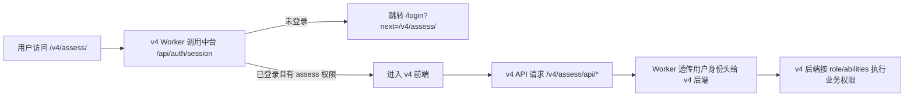

# v4 自带登录适配中台账号方案

v4 在线考试系统原本如果有自己的管理员账号、普通账号和登录页面，线上接入 Sportslack 后需要改成“中台统一登录，v4 只接收当前用户身份”。

## 改造目标

- 账号源只有一套：智能插件中台。
- v4 不再创建、删除、修改登录账号。
- v4 可以继续保留管理员/普通用户的业务角色判断。
- v4 可以继续保留本地用户表，但本地用户表只作为业务资料表，不再保存登录密码。

## 登录流程



## 前端要改什么

1. 删除或隐藏 v4 自己的登录页。
2. 删除或隐藏注册、忘记密码、修改密码、账号管理入口。
3. 需要当前用户信息时，调用后端 session 接口，或新增：

```text
GET /v4/assess/api/auth/session
```

4. 如果接口返回 401，跳转：

```js
window.location.href = "/login?next=/v4/assess/";
```

5. 退出登录调用：

```js
await fetch("/api/auth/logout", { method: "POST" });
window.location.href = "/login";
```

## 后端要改什么

后端从请求头读取当前登录用户：

```text
x-sportslack-user
x-sportslack-role
x-sportslack-plugins
x-sportslack-abilities
```

建议映射：

```js
const username = request.headers.get("x-sportslack-user");
const role = request.headers.get("x-sportslack-role");
const isAdmin = role === "admin";
```

如果原系统有本地用户表：

1. 用 `username` 查本地用户。
2. 找不到就自动创建。
3. 本地用户不保存密码，或忽略原密码字段。
4. 本地角色每次按 `x-sportslack-role` 同步。

## 权限映射

```text
中台 role=admin -> v4 管理员
中台 role=user  -> v4 普通账号
```

更细能力：

```text
view   -> 可以访问 v4
take   -> 可以参加考试、读取试题
grade  -> 可以查看成绩、判分、报告
manage -> 可以管理题库、考试、导入、用户关联
```

如果接口需要限制能力，后端可以解析：

```js
const abilities = JSON.parse(request.headers.get("x-sportslack-abilities") || "{}");
const canManage = abilities.assess?.includes("manage");
```

## 不要再做的事

- 不要让 v4 自己设置登录 cookie。
- 不要让 v4 自己保存账号密码。
- 不要让 v4 自己做管理员账号创建。
- 不要在 v4 里提供注册入口。
- 不要绕过 `/v4/assess/*` Worker 路由直接暴露后端。
